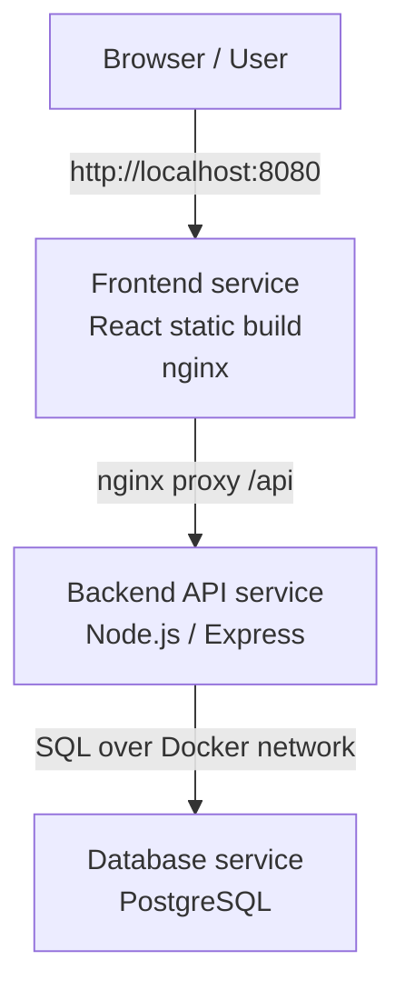
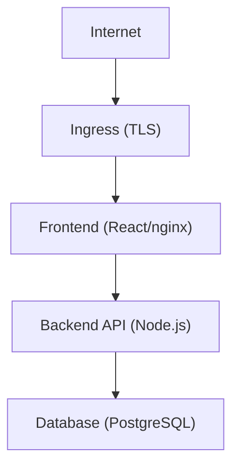

# Architecture

## Target Local Architecture

## Final Project Direction

## Service Responsibilities

| Service | Responsibility |
| --- | --- |
| Frontend | UI, static assets, browser experience, reverse proxy to `/api` |
| Backend API | Business logic, validation, REST endpoints, database access |
| Database | Persistent storage for tasks |

