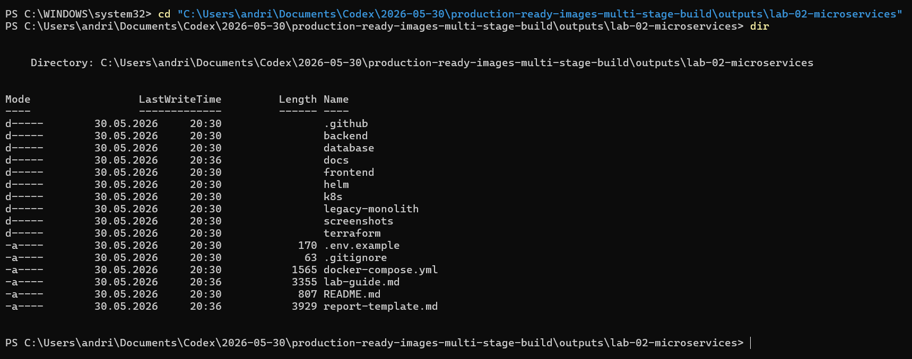
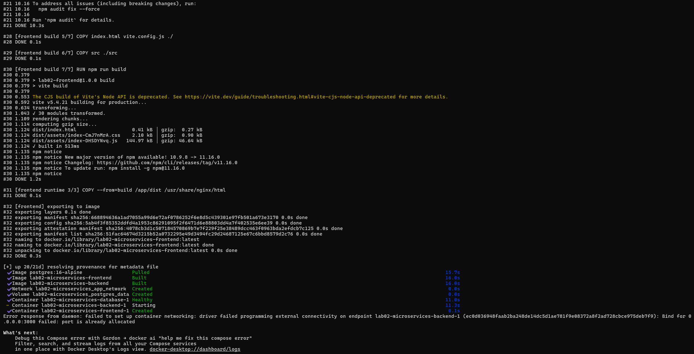
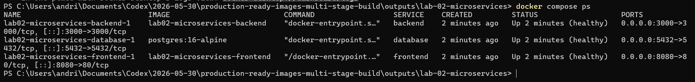
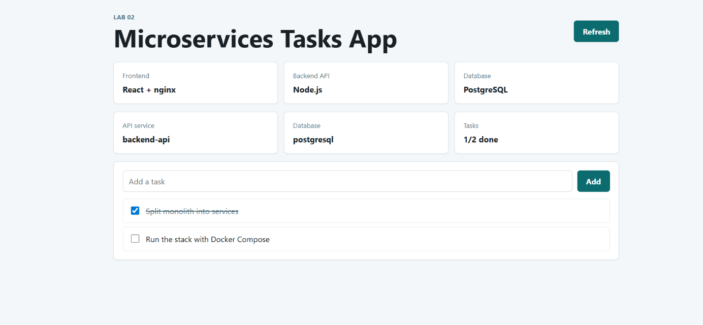
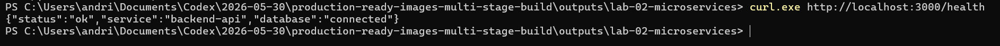
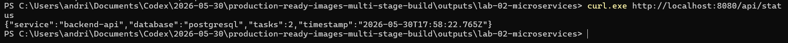
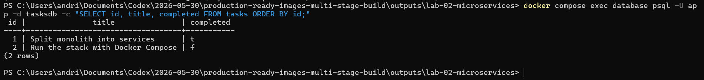
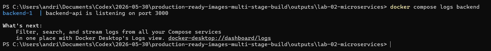
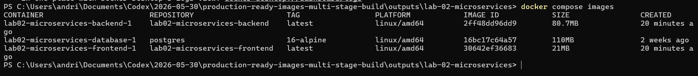

# Звіт з лабораторної роботи 2

## Тема

Побудова мікросервісної архітектури: перехід від LAMP-моноліту до Docker Compose stack.

## Мета

Навчитися розбивати монолітний застосунок на окремі сервіси: frontend, backend API та database. Запустити локально працюючий стек мікросервісів за допомогою Docker Compose.

## Архітектура

```text
Browser
↓
Frontend (React/nginx)
↓
Backend API (Node.js)
↓
Database (PostgreSQL)
```

У локальній лабораторній роботі frontend доступний на `http://localhost:8080`, backend API доступний на `http://localhost:3000`, а PostgreSQL працює як окремий сервіс усередині Docker Compose network.

## Структура проєкту

```text
lab-02-microservices/
├── frontend/
├── backend/
├── database/
├── legacy-monolith/
├── docs/
├── k8s/
├── helm/
├── terraform/
├── .github/workflows/
└── docker-compose.yml
```



## Хід роботи

### 1. Запуск Docker Compose stack

Було виконано команду:

```powershell
docker compose up --build -d
```

Docker Compose зібрав images для `backend` і `frontend`, створив network, запустив `database`, `backend` і `frontend`.



### 2. Перевірка контейнерів

Було виконано команду:

```powershell
docker compose ps
```

У результаті видно, що запущені три сервіси: `database`, `backend` і `frontend`.



### 3. Перевірка frontend

У браузері було відкрито:

```text
http://localhost:8080
```

Frontend успішно відкрився і показав React-застосунок `Microservices Tasks App`. На сторінці видно, що frontend отримує дані з backend API, а backend підключений до PostgreSQL.



### 4. Перевірка backend API

Було виконано команду:

```powershell
curl.exe http://localhost:3000/health
```

Backend повернув успішний health response, що підтверджує роботу API та підключення до database.



### 5. Перевірка nginx proxy до API

Було виконано команду:

```powershell
curl.exe http://localhost:8080/api/status
```

Запит йде на frontend/nginx, а nginx проксіює `/api` до backend service. Це підтверджує зв'язок `frontend → backend`.



### 6. Перевірка database

Було виконано команду:

```powershell
docker compose exec database psql -U app -d tasksdb -c "SELECT id, title, completed FROM tasks ORDER BY id;"
```

PostgreSQL повернув записи з таблиці `tasks`, що підтверджує роботу database service і збереження даних.



### 7. Перевірка backend logs

Було виконано команду:

```powershell
docker compose logs backend
```

Logs показують, що backend service стартував і слухає порт `3000`.



### 8. Використання практик з лабораторної 1

Було виконано команду:

```powershell
docker compose images
```

Це показує Docker images, які використовуються в мікросервісному stack. У Lab 2 використано практики з Lab 1: production-ready Dockerfiles, `.dockerignore`, healthchecks, мінімальні base images і можливість security scanning.



## Перехід від LAMP-моноліту до microservices

| Було в LAMP-моноліті | Стало в microservices |
| --- | --- |
| PHP templates | React frontend |
| Apache serving | nginx container |
| PHP business logic | Node.js API |
| Inline SQL queries | Backend database layer |
| MySQL у спільному stack | PostgreSQL service |
| Один deployment | Окремі Docker services |

## Використання практик з Lab 1

| Практика з Lab 1 | Реалізація в Lab 2 |
| --- | --- |
| Multi-stage build | `frontend/Dockerfile` |
| Optimized Dockerfile | `backend/Dockerfile` |
| `.dockerignore` | `frontend/.dockerignore`, `backend/.dockerignore` |
| Healthcheck | `docker-compose.yml`, `frontend/Dockerfile`, `backend/Dockerfile` |
| Non-root runtime | `backend/Dockerfile` використовує `USER node` |
| Мінімальні images | `node:22-bookworm-slim`, `nginx:1.27-alpine`, `postgres:16-alpine` |

## Висновок

У лабораторній роботі було створено локальний microservices stack з трьох сервісів: `frontend`, `backend API` та `database`. Frontend реалізовано на React і запущено через nginx, backend API реалізовано на Node.js, а дані зберігаються в PostgreSQL.

Docker Compose дозволив запустити весь stack однією командою та перевірити взаємодію між сервісами локально. Також у Lab 2 використано практики з Lab 1: optimized Docker images, `.dockerignore`, healthchecks і розділення build/runtime. Цей проєкт є основою для подальших лабораторних, де будуть додані Kubernetes, Helm, CI/CD, GitOps, monitoring, logging і security.
